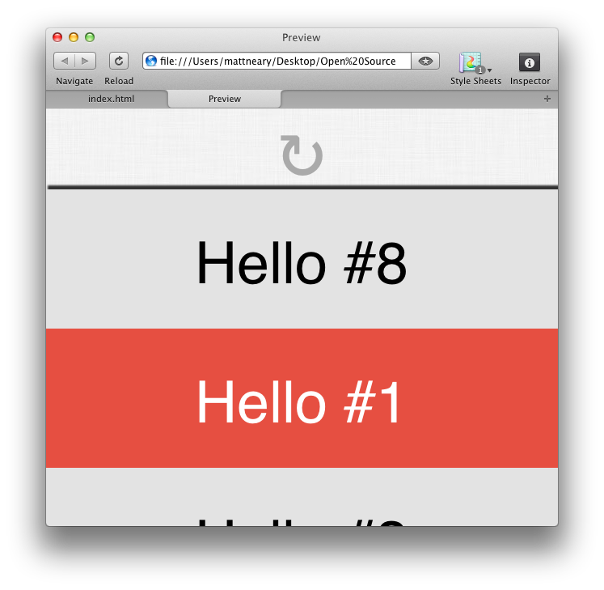

Introduction
============
Pull to refresh is a very prevalent design pattern in mobile apps. However, when making apps for other devices, developers are often unable to find the analog for new platforms. This is where Elastic comes in, offering a desktop experience consistent with pull to refresh.



Usage
=====
Make a wrapper of your content with a banner element and a container of your page's content.
```html
<div class="wrapper">
	<div class="banner"></div>
	<div id="main">
	<!--
		contents of website...	
	-->
	</div>
</div>	
```

Tell the jQuery plugin how to handle the refreshing of a given wrapper.
```javascript
$(".wrapper").pullToRefresh(function(finishedRefreshCallback) {
	// refresh content... 
	putList();
	
	// ...then tell pullToRefresh to finish
	setTimeout(finishedRefreshCallback, 1e3);
});
```